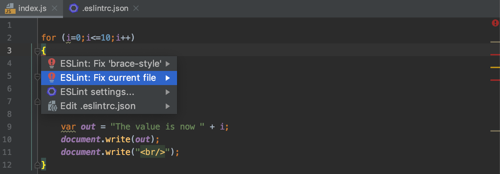

  
# Software quality handbook

## Introduction  
PuppyPlanner has been imagined by puppy-lover's in order to help their master to organize their everyday life. The project is available on mobile devices as a mobile application and on customer’s favourite web browser as a web application.

Internally, there are 4 teams at PuppyPlanner: the mobile application team made up of 8 people, the front-end and the back-end development teams, each made up of 3 people for the web application and the core team made up of 6 people that takes care of the API, the database and the business logic.

***

## Task estimation

***

## Coding standards

### Introduction to Gitflow
Gitflow is a strict branching model designed around the project release imagined by Vincent Driessen about 10 years ago. It probably remains the most popular Git workflow design nowadays. Gitflow simplicity might have made the tool's reputation. This is why PuppyPlanner developers must use this Git workflow.  

There are only 5 types of branch allowed in this model :  
- **Master** is unique and contains the official release history.  
- **Develop** is unique too and serves as an integration branch for features.  
- **Feature** branches are created when a new feature needs to be added to the project.  
- **Release** branches group features merged on develop before being pushed on master.  
- **Hotfix** branches are made for quick patch production releases.  

### Gitflow configuration and workflow
First of all, it is necessary to get the Git project on the machine. We recommend to install it on Windows since it is the most common Operating System at PuppyPlanner. You have to install [Git](https://git-scm.com/download/win) on the computer. Then, you will need to clone the project on the machine by entering the following command on the Git Bash prompt freshly installed :
```git
git clone git@github.com:<github-username>/sqa-infs3028.git
```
You now have a local version of the project on your computer. If you want to add a feature to the project, please enter the following command :
```git
git flow feature start feature_branch
```
It is worth noting that feature branch names must follow the [snake case](https://fr.wikipedia.org/wiki/Snake_case) convention. When you finished the feature development and you want to merge your work on the develop branch, please enter the following command :
```git
git flow feature finish feature_branch
```
Finally, when the develop branch contains all the predicted features of the next release, you can create a release branch by entering the following :
```git
git flow release start 1.0.1
```
Of course, feel free to replace the release number of this example by the actual release number. In addition to this release number, you have to fill the CHANGELOG.md file with your commits; you can find this file at the project root. This file has been written in Markdown and must be completed in accordance with the following template :
```Markdown
## [Next release number] - today’s date
### Added
- first commit made for added features
- second commit made for added features
- ...
### Updated
- first commit made for updated features
- second commit made for updated features
- ...
### Removed
- first commit made for removed features
- second commit made for removed features
- ...
```
If there is nothing in one of the parts, don't add it in the file CHANGELOG.md. Finally, if you are not comfortable with command line, feel free to use [GUI](https://www.computerhope.com/jargon/g/gui.htm) tools like [GitKraken](https://support.gitkraken.com/git-workflows-and-extensions/git-flow/) or [SourceTree](https://www.sourcetreeapp.com/) made by Atlassian.

### Insure JavaScript code quality
  
_Figure 2: Screenshot of the ESLint plugin for JetBrains_

The seventh version of ESLint has been released in February 2020; so less than two month before this handbook fulfillment. Shortly, ESLint is a pluggable linter for JavaScript that finds and fixes problems in the code. This tool not only standardize the code within a team but also in the whole company because all parts of PuppyPlanner have been thought to be based on Node.js. Briefly, about PuppyPlanner, the web part has been developed in [React](https://reactjs.org/), the mobile part has been developed with [React Native](https://reactnative.dev/) and the core is based on [Node.js](https://nodejs.org/). Needless to say, the installation will be quite tough because each member of the company who develops will have to do a code refactoring. This is why developers are strongly advised to use [WebStorm](https://www.jetbrains.com/webstorm/) - an IDE made by JetBrains - and download the dedicated [ESLint plugin](https://www.jetbrains.com/help/webstorm/eslint.html).

### Write consistent commit messages

PuppyPlanner beginnings turned quite chaotic because of liberties given to each teams; in particular, git commits are absolutely senseless. Thankfully, Git gives many possible configuration out of the box and the `commit.template` command is especially interesting regarding commits. Please enter the following command to set up the PuppyPlanner git message on your machine :
```git
git config --local commit.template “$HOME/<path-to-cloned-project>/.gitmessage”
```
This configuration will ensure you write proper commit messages. The commit command is now the following :
```git
git commit
```
That’s all folks ! Well, not exactly because this command will now open your default text editor and you will have to complete the commit message in accordance with the displayed template but you don’t need the `-m “<commit message>”` extension anymore. Then, all you need to do is enter the following and you are good :
```git 
git push origin <feature_branch>
```

***

## Code reviews
***

## Sources

### Task estimation

### Coding standards
https://chris.beams.io/posts/git-commit  
https://rubygarage.github.io/slides/git/gitflow#/15  
https://nvie.com/posts/a-successful-git-branching-model  
https://backlog.com/blog/git-commit-messages-bold-daring  
https://eslint.org/blog/2020/02/whats-coming-in-eslint-7.0.0  
https://daemotron.github.io/2017/05/02/Git-Flow-Groundhog-Day.html  
https://www.atlassian.com/git/tutorials/comparing-workflows/gitflow-workflow  
https://thoughtbot.com/blog/better-commit-messages-with-a-gitmessage-template  

***