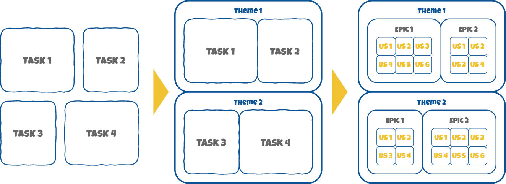

<!-- TODO add resource picture -->
<!--    -->
# Software quality handbook

## Introduction  
PuppyPlanner has been imagined by puppy-lover's in order to help their master to organize their everyday life. The project is available on mobile devices as a mobile application and on customer’s favourite web browser as a web application.

Internally, there are 4 teams at PuppyPlanner: the mobile application team made up of 8 people, the front-end and the back-end development teams, each made up of 3 people for the web application and the core team made up of 6 people that takes care of the API, the database and the business logic.

***

## Task estimation

### Smash your tasks into epics
Tasks are often substantial blocs of many smaller tasks that development team members discover as they carry out the aforesaid task. You should never estimate a task like this. Why not dividing it up instead ? First, you should separate the biggest tasks in themes. Then you might define those biggest tasks as epics and split them into smaller task called user stories. In this way, task estimation - or more accurately user stories estimation - is easier to perform and any mistake due to task estimation is easier to manage. By the way, the list of user stories constitute your product backlog.

### Uncertainty and confidence margins
As a team, you should not blame each other for bad time estimation because a user story estimation will never be perfect; that’s how it is. To keep the team chin up, you might use uncertainty and confidence margins within estimations. For each task evaluation, vote an uncertainty percentage and a confidence one and apply these percentages in the description. Be careful to ensure that the percentage does not exceed 50%. Otherwise, you probably made a bad estimation of the user-story.

<!-- TODO add resource picture -->
<!--    -->
<!-- _Figure 1: Define user stories from substantial tasks_ -->

***

## Coding standards

***

## Code reviews
***

## Sources

***